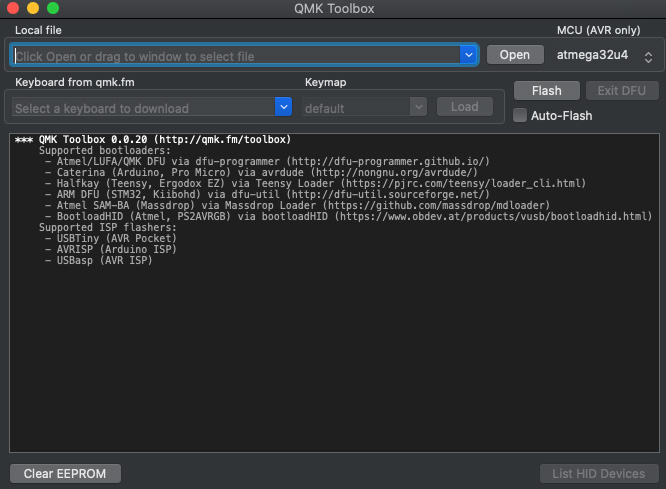
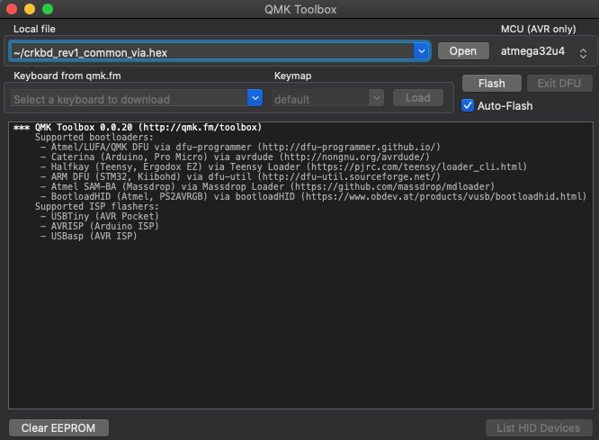
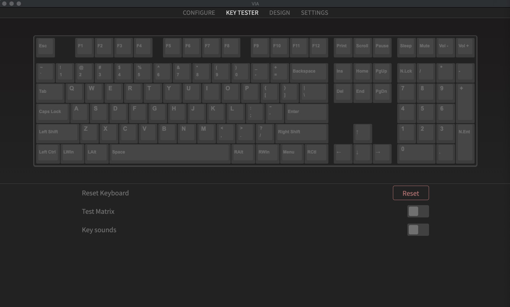

# Firmware

## Flash the firmware

There are several ways to flash the firmware,
but using [QMK Toolbox](https://github.com/qmk/qmk_toolbox) is the easiest way.

### Download QMK Toolbox

Download QMK Toolbox from the following link.\
<https://github.com/qmk/qmk_toolbox/releases/>


Install QMK Toolbox from the downloaded file. \
Follow the instructions for each operating system for installation.

Open QMK Toolbox, you will see a window like the one below.



### Flash the firmware

Download the firmware of VIA from the following link.\
[crkbd_rev1_common_via.hex](https://raw.githubusercontent.com/foostan/qmk_firmware-hex/main/.build/crkbd_rev1_via.hex)

Specify the file downloaded from "**Open**" in QMK Toolbox.
And enable the check box for "**Auto-Flash**".



With the keyboard connected via USB,
press the reset button **twice** or short **GND & RST** pins on ProMicro to start flashing the firmware. \
If you see the message, it's done.


Once the firmware has been written to one side of the Pro Micro,
follow the same procedure for the other side.

### (Optional) If you build the firmware yourself

Refer to [the QMK _getting started_ guide](https://docs.qmk.fm/#/newbs_getting_started),
and install the necessary software according to your OS
(it takes quite some time to install).

Once the environment is ready,
build the firmware for Crkbd with the following command.

```
make crkbd:via
```

When the build is completed,
execute the following command to flash.

```
make crkbd:via:avrdude
```

When you execute it,
you will see the following output (`.`'s progressively appearing).
Press the reset switch **twice** or short **GND & RST** pins on ProMicro during this time to complete the firmware writing.
Depending on the ProMicro, it may be only require pressing reset switch once.

```
Checking file size of crkbd_rev1_default.hex [OK]
 * File size is fine-27328/28672
Copying crkbd_rev1_default.hex to qmk_firmware folder [OK]
Detecting USB port, reset your controller now ........
```

Once the firmware has been written to one side of the Pro Micro,
follow the same procedure for the other side.

## Change your keymap

The Corne Keyboard is supported by [VIA](https://caniusevia.com/). \
It can be used by flashing the firmware for VIA as described above.

### Download VIA

Download VIA from the following link.\
<https://github.com/the-via/releases/releases/>


Install VIA from the downloaded file. \
Follow the instructions for each operating system for installation.

When VIA is opened with the keyboard plugged in, the following window will appear.


### Configure

In this screen, you can change the keymap.

There are several types of keys that can be changed
and you can find them in the "1" area.
If you want to change the key,
click on "2" to change the key and "3" to select the key you want to change.
VIA instantly changes the keymap.


### Tester

In this screen, you can test the operation of the keymap.

You can confirm that the key is set correctly
by checking that the color of the key you press changes.



Test Matrix allows you to check the operation of each switch on the keyboard.
It is easier to check the operation of each switch after build.


### Lighting

In this screen, you can change the pattern and color of the LEDs.


