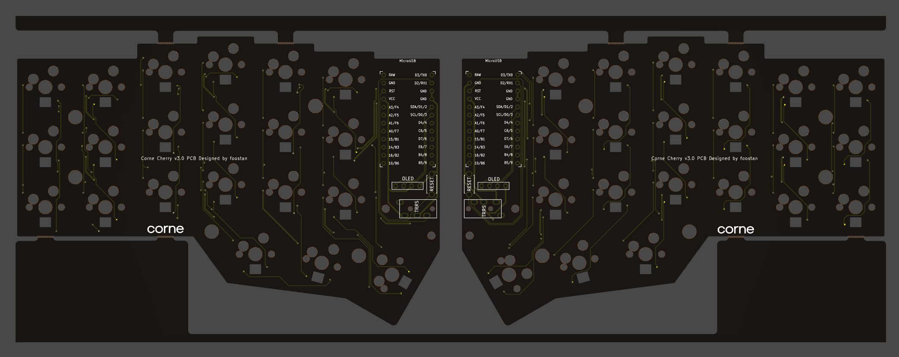
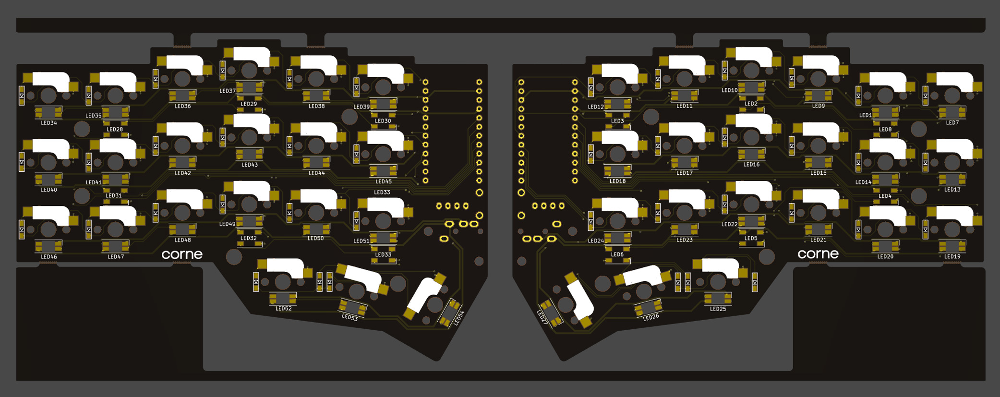
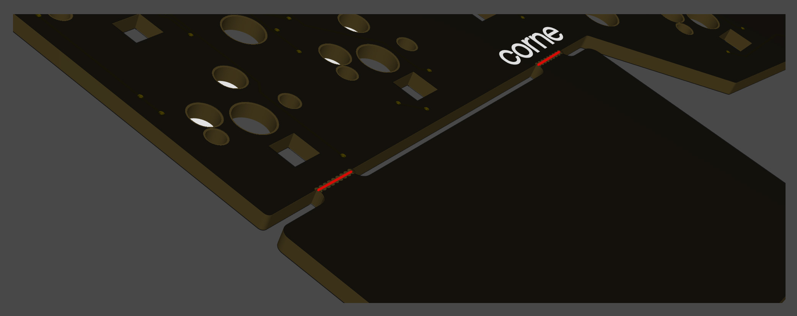
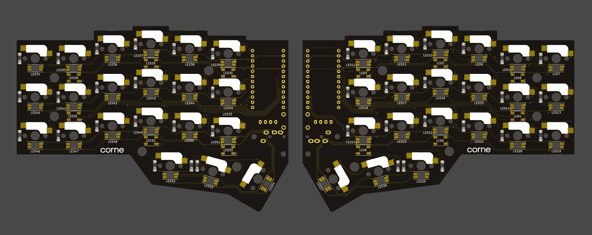
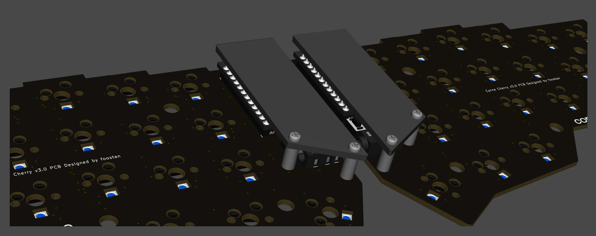
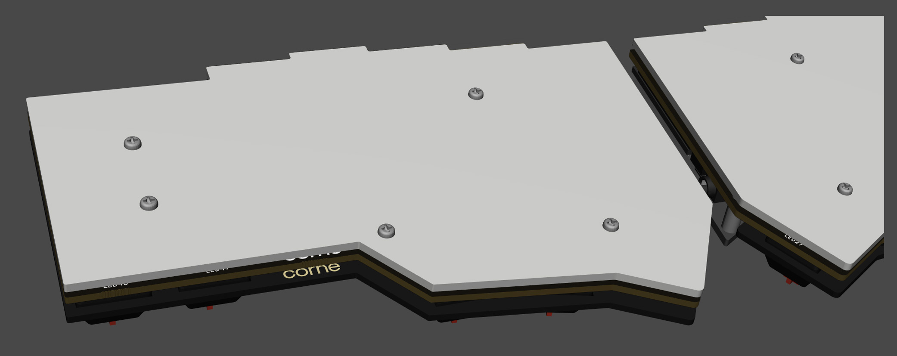

# Build Guide

こちらは Corne Cherry v3 のビルドガイドになります。
[Corne Cherry v2 はこちら](https://github.com/foostan/crkbd/blob/master/corne-cherry/doc/v2/buildguide_jp.md)。

## 部品

### 必須

| 名前 | 数 | 備考 |
|:-|:-|:-|
| PCB | 1セット | |
| トッププレート | 2枚 | |
| ボトムプレート | 2枚 | |
| OLED保護プレート | 2枚 | |
| ProMicro | 2枚 | |
| TRRSジャック | 2個 | |
| タクトスイッチ | 2個 | |
| ダイオード | 42本 | SMD部品のみ対応 |
| PCBソケット | 42個 | Kailh および Gateron に対応 |
| キースイッチ | 42個 | CherryMX互換のみ対応 |
| キーキャップ | 42個 | 1u 40個、1.5u 2個 |
| スペーサー M2 7.5mm | 10本 | |
| スペーサー M2 9mm | 4本 | |
| ネジ M2 4mm | 28本 | |
| クッションゴム | 8個 | |
| TRRS(4極)ケーブル | 1本 | TRS(3極)ケーブルでも可 |
| Micro USBケーブル | 1本 | |

### オプション

| 名前 | 数 | 備考 |
|:-|:-|:-|
| OLEDモジュール | 2枚 | |
| OLEDモジュール用ピンヘッダ 4連 1.5mm | 2つ | |
| OLEDモジュール用ピンソケット 4連 2.5mm | 2つ | |
| SK6812MINI-E | 42個 | Back light用 LEDs |
| WS2812B | 12個 | Undergrow 用 LEDs |

## 事前準備

ファームウェアを自分でビルドする場合は環境を整備するのに時間がかかるのではじめに取り掛かっておくことをおすすめします。\
詳しくは <https://github.com/foostan/crkbd/blob/master/doc/firmware_jp.md> を参照してください。

## 確認

Corne Cherry v3 のPCBは以下のものになります。お手持ちのPCBと同一のものかご確認ください。

PCBは製造の都合上フレームが付いた状態となっています。
手で折って外すことができますが、難しい場合は接合部分※にカッター等で切り込みを入れると外しやすくなります。
また、接合部分はヤスリ等できれいにすることができます。

※ 接合部分: 下記画像の赤で記した部分のこと、計8箇所あります

## 組み立て

### ダイオード

SMD部品のダイオードのはんだづけを行います。
SMD部品は非常に小さいためピンセット及び逆作用ピンセットがあると便利です。

**ダイオードは取り付ける向きが決まっていて**、部品の「|」印が、ダイオードマーク「|◁」の「|」の方に向けるようにはんだづけを行います。
なお、Corne の PCB はダイオードの取り付け向きがすべて統一されています。

TIPS: SMD部品を取り付けるコツ

SMD部品を取り付けるコツですが、まずは予備ハンダとしてパットの片側のみにハンダを盛ります。

次に予備ハンダを溶かすようにしてダイオードの片足をはんだ付けします。
このとき、逆作用ピンセットを利用すると力を入れずともチップ部品をしっかりと持つことができ、位置合わせとはんだづけに集中できるのでおすすめです。
またはんだごてがあつすぎたり、はんだを触りすぎたりするとはんだに含まれるフラックスが気化してきれいにはんだの山ができることがありますが、あとで修復できるのでこの時点ではパーツを付けることだけを意識すれば大丈夫です。

片足をつけた段階で横から見てダイオードが浮いていなければ大丈夫です。浮いてしまった場合はダイオードをピンセットや指で押さえつけながらはんだごてではんだづけした部分を再度熱すればきれいになります。

次にもう片方をはんだづけします。少量のはんだで十分なのでつけすぎに注意します。
つけすぎてしまった場合は吸い取り線で取るか、はんだごてですくうようにすれば取れます。

また予備はんだ側のはんだの量が少ない場合は追加ではんだづけを重ねて行い、山になっている場合はフラックスを上から塗って熱すればきれいになります。

左右合わせて42個をはんだづけしてダイオードは完了です。

### LED（オプション）

SK6812MINI-E と WS2812B をはんだづけします。

先に取り付け後の様子を確認しておきます。

はんだづけはすべて裏側から行いますが、SK6812MINI-E は Backlight (表側を光らせる)用、WS2812B は Undergrow (裏側を光らせる)用になっています。

#### WS2812B (Undergrow)

まずは WS2812B をはんだづけします。

下記のように WS2812B の凹みの角とPCBの角印が合う向きにしてはんだづけを行います。
__TIPS: SMD部品を取り付けるコツ__ で紹介したように、予備ハンダをするとうまくつけられると思います。

なお、Corne の PCB は WS2812B の取り付け向きがすべて統一されています。

左右合わせて計12個はんだづけして WS2812B は完了です。

#### SK6812MINI-E (Backlight)

続いて SK6812MINI-E をはんだづけします。

下記のように SK6812MINI-E の角が欠けた足とPCBの角印が合う向きにしてはんだづけを行います。
__TIPS: SMD部品を取り付けるコツ__ で紹介したように、予備ハンダをするとうまくつけられると思います。
SK6812MINI に比べて壊れにくいですが、はんだごての熱を直接受けると破損する可能性があります。温調機能のついたはんだごてで 320℃ ほどであれば、4つの足を連続にはんだづけしても問題なさそうでした。

なお、Corne の PCB は SK6812MINI-E の取り付け向きがすべて統一されています。

左右合わせて計42個はんだづけして SK6812MINI-E は完了です。

### TRRSジャック、リセットスイッチ、OLED用ピンソケット

下記の写真通りにTRRSジャック、リセットスイッチ(タクトスイッチ)、OLED用ピンソケットをはんだづけします。

ずれやすい部品なので、手で部品を抑えながらはんだづけするか、マスキングテープ等で固定してからはんだづけするときれいに付きます。

### ProMicro

ProMicroを下記のような向きではんだ付けします

なお、コンスルーを利用する場合は裏側のはんだ付けをする必要はありません。
コンスルーの詳しい利用方法は [Helix のビルドガイド](https://github.com/MakotoKurauchi/helix/blob/master/Doc/buildguide_jp.md#pro-micro)をご参照ください。

### OLEDモジュール

OLED用のピンソケットにピンヘッダを先に差し込み、その後からピンヘッダとOLEDモジュールをはんだづけします。
このときOLEDモジュールが浮きやすいので指で押さえつけながら浮かないように気をつけます。

## ファームウェア

下記を参照しファームウェアをProMicroに書き込みます。\
<https://github.com/foostan/crkbd/blob/master/doc/firmware_jp.md>

### 動作確認

ProMicroとOLEDモジュールを付けた段階で動作確認をすることをおすすめします。
一番最後にやると問題の切り分けが難しくなります。

動作確認は左手側はMicroUSBでPCとつなぎ、左手側と右手側をTRRSケーブルで接続させて行います。ジャック等の不良等もありえるので、片方ずつではなく必ず左右を接続させてから動作確認をしてください。ここまで正しくできていれば、PCBソケットを取り付けるパットをピンセット等でショートさせるとOLEDモジュールに押されたキーが表示されます。

### PCBソケット

PCBソケットを下記のようにマークに合わせてはんだづけします。
下記ではすべてのPCBソケットが並んでいますが、しっかりハマるものではないので、1つずつ付けてください。
__TIPS: SMD部品を取り付けるコツ__ で紹介したように、予備ハンダをするとうまくつけられると思います。

左右合わせて計42個はんだづけしてPCBソケットは完了です。

### OLED保護プレート

M2 9mm のスペーサーと M2 ネジで OLED 保護プレートを取り付けます。

### プレート、スイッチ

トッププレートにキースイッチに取り付けた後、キースイッチをソケットにはめ込みます。
先にすべてのキースイッチをトッププレートに取り付けてしまうと、ソケットにはめ込む難易度が上がってしまうため、先に端のキースイッチのみを取り付ける方が簡単です。

M2 7.5mm のスペーサーと M2 ネジ をトッププレートに取り付けます。

裏側からスペーサーを穴に入れた後、ネジ止めをすると簡単です。

ボトムプレートを M2 ネジで取り付けます。

クッションゴムを以下の位置に取り付けます。

以上で完成です。

