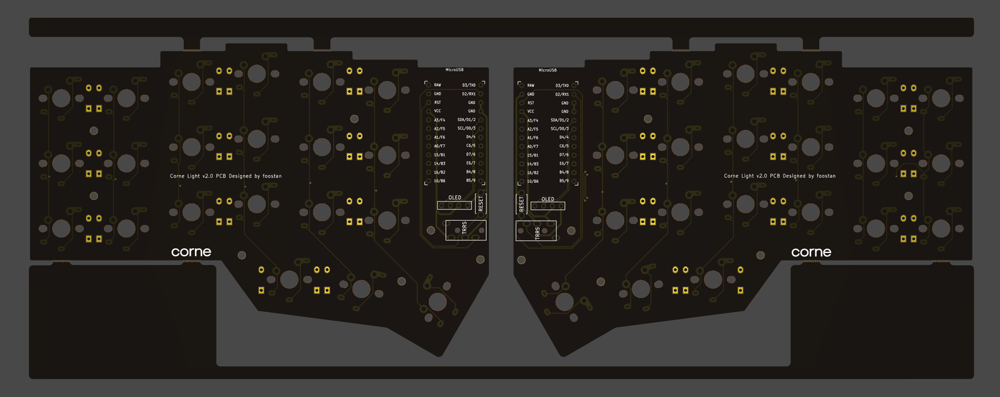
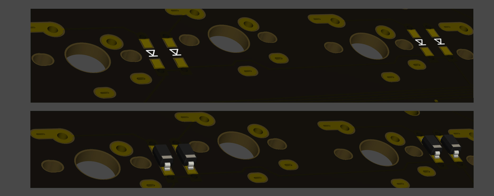
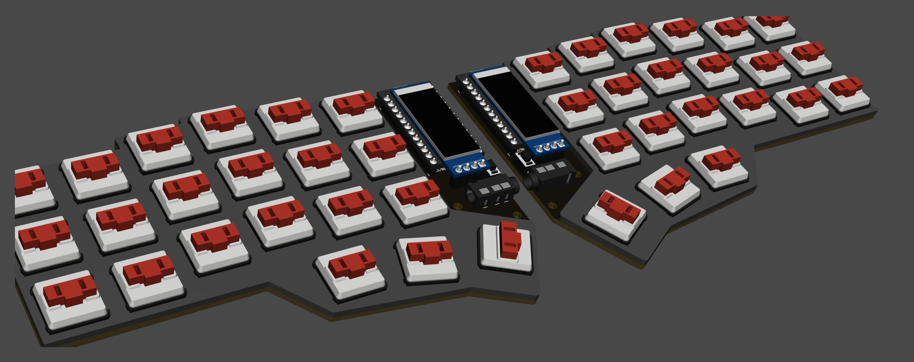
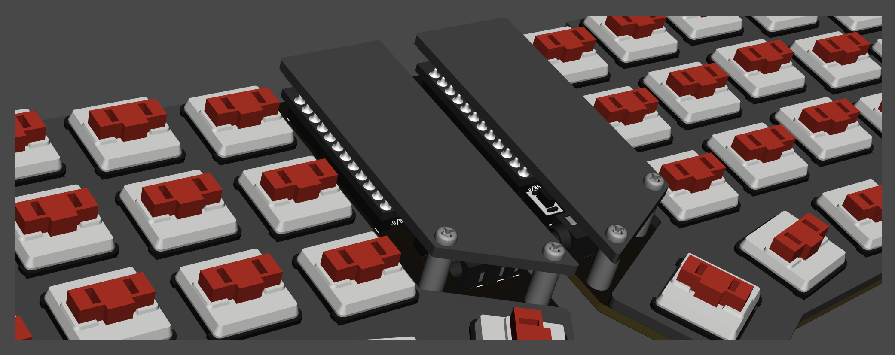
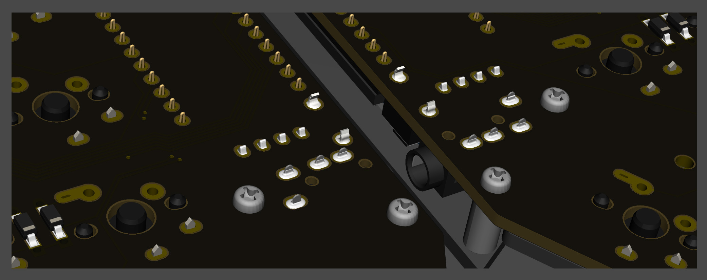
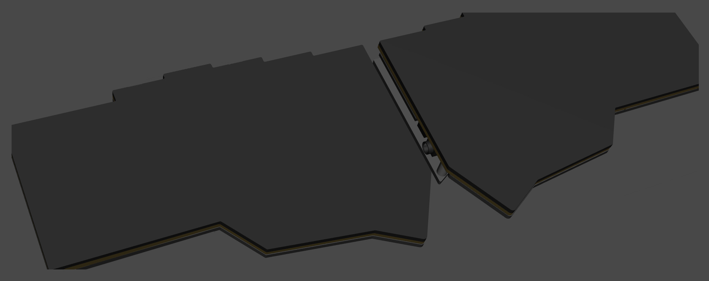

# Build Guide

This is the build guide for Corne Light v2 Low edition.

## Parts

### Required

| Name | Count | Remarks |
|:-|:-|:-|
| PCB | 1 set | |
| Top plate (acrylic) 2mm | 2 sheets | |
| Bottom foam | 2 sheets | Special foam is cut out with a special mold |
| OLED protective plate | 2 sheets | |
| ProMicro | 2 sheets | |
| TRRS jack | 2 | |
| Tact switch | 2 | |
| Diodes | 42 | Recommended SMD Parts |
| Key switches | 42 | Kailh Choc v1 or v2 recommended |
| Keycaps | 42 pcs | 1u 40 pcs, 1.5u 2 pcs |
| Spacer M2 9mm | 4 pieces | |
| Screw M2 4mm | 8 screws | |
| TRRS (4 poles) cable | 1 | TRS (3 poles) cable is also acceptable |
| Micro USB cable | 1 | |

### Optional

| Name | Count | Remarks |
|:-|:-|:-|
| OLED module | 2 sheets | |
| Pin header for OLED module 4 series 1.5mm | 2 | |
| 4 pin sockets for OLED module 2.5mm | 2 | |

## Advance preparation

If you build the firmware yourself,
it takes time to prepare the environment,
so it is recommended to start first. \
See <https://github.com/foostan/crkbd/blob/master/doc/firmware_en.md>
for more information.

## Verification

The PCB for Corne Light v2 is as follows.
Make sure it is the same as your PCB.

The PCB comes with a frame for manufacturing reasons.
You can fold it by hand to remove it, but if it is difficult,
make a cut in the joint \* with a cutter or similar,
to make it easier to remove.
In addition, the joint can be cleaned with a file.

\* *Joint part: There are a total of 8 parts,
which are marked in red in the image below.*

## Assembly

### Diodes

Solder diodes for SMD components.
Since SMD parts are very small,
it is convenient to have tweezers and counter-acting tweezers.

**The diode has a fixed mounting direction**,
so solder it so that the "|" mark on the part faces the "|" on the diode mark "|◁".
In addition, Corne's PCB has all the same diode mounting orientations.

TIPS: Tips for installing SMD parts

The trick is to attach the SMD parts, but first, as a spare solder,
put the solder on only one side of the pad.

Next, solder one leg of the diode so that the spare solder melts.
At this time, it is recommended to use reverse-action tweezers,
because you can hold the chip parts firmly without exerting force
and you can concentrate on alignment and soldering.
Also, if the soldering iron is too hot or the solder is touched too much,
the flux contained in the solder may evaporate and form a clean pile of solder,
but it can be repaired later,
so at this point you should only care about attaching parts.
It's okay.

It is okay if the diode does not float when viewed from the side
when one foot is attached.
If it floats, press the diode with tweezers or your fingers
and reheat the soldered part with a soldering iron to clean it.

Then solder the other one.
Be careful not to apply too much,
as a small amount of solder is sufficient.
If you apply too much, you can remove it with a blotting wire
or by scooping it with a soldering iron.

If the amount of solder on the preliminary solder side is small,
additional soldering is performed, and if it is a mountain,
apply flux from above and heat it to clean it.

The diode is completed by soldering 42 pieces in total on the left and right.

### TRRS jack, reset switch, pin socket for OLED

Solder the TRRS jack, reset switch (tact switch),
and OLED pin socket as shown in the picture below.

Since it is a part that easily slips off,
you can solder it while holding the part by hand,
or fix it with masking tape and then solder it.

### ProMicro

Solder ProMicro in the following orientation

If you use spring-loaded pin headers (e.g. Conthrough),
you do not need to solder the back side.
Please refer to the [Helix Build Guide](
https://github.com/MakotoKurauchi/helix/blob/master/Doc/buildguide_en.md#pro-micro)
for details on how to use spring-loaded pin headers.

### OLED module

Insert the pin header into the pin socket for OLED first,
and then solder the pin header and OLED module.
At this time, the OLED module is easy to float,
so be careful not to float it while pressing it with your finger.

### Firmware

Write the firmware to ProMicro by referring to the following. \
<https://github.com/foostan/crkbd/blob/master/doc/firmware_en.md>

### Operation check

We recommend that you check the operation when the ProMicro and OLED module are attached.
If you do it at the very end, it will be difficult to isolate the problem.

To check the operation,
connect the left hand side to the PC with MicroUSB,
and connect the left hand side and the right hand side with the TRRS cable.
Since there may be defects such as jacks,
be sure to connect the left and right instead of one by one
before checking the operation.
If it is done correctly so far,
if you short the pad to attach the PCB socket with tweezers etc.,
the key pressed on the OLED module will be displayed.

### Top plate, switch

After attaching the key switch to the top plate, solder the key switch.
If you attach all the key switches to the top plate first,
it will be more difficult to attach the switches to the board,
so it is easier to attach only the end key switches first.

### OLED protective plate

Attach the OLED protective plate with M2 9mm spacers and M2 screws.

Especially for the screws on the back side,
tighten them firmly to attach the bottom foam after this.

### Bottom form

Finally, paste the bottom form.
This foam has an adhesive surface on one side
and a non-slip surface on the other side.
Stick the adhesive side firmly to the PCB.

That's it.

